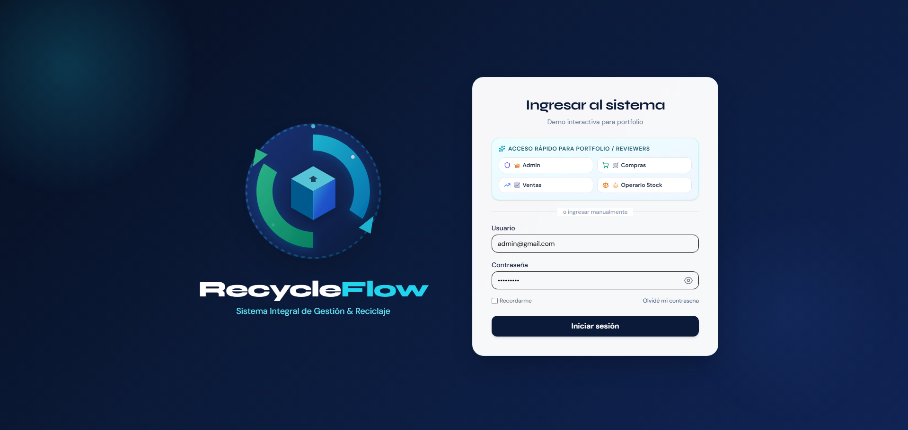
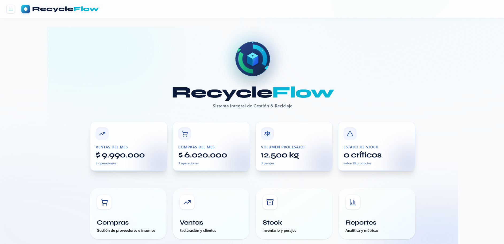
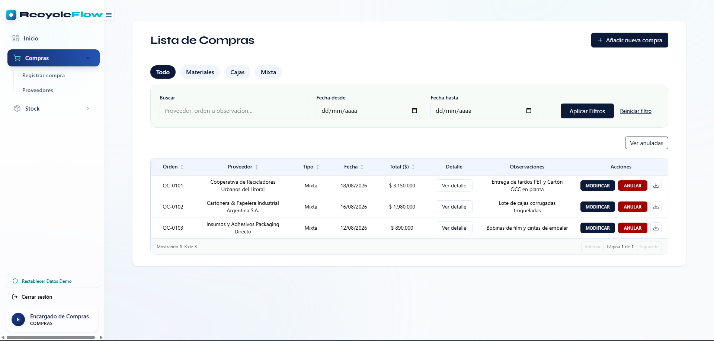
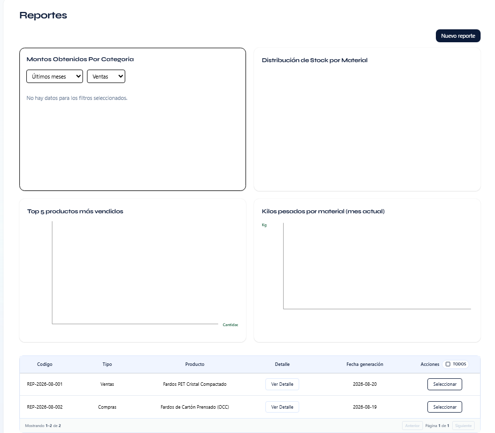
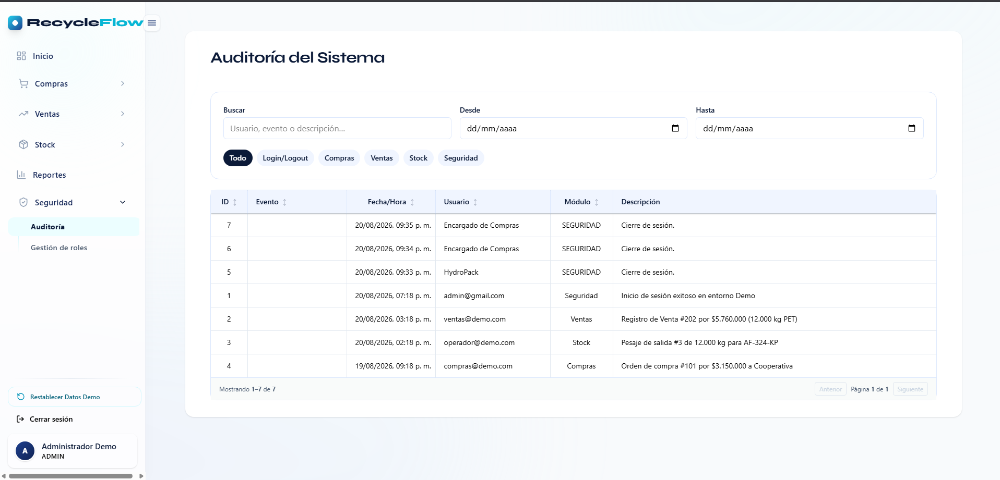
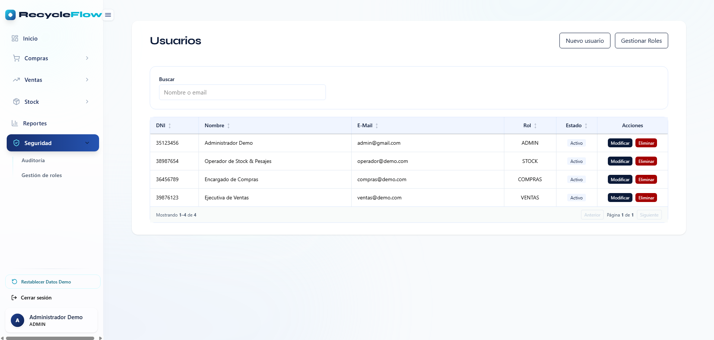

# RecycleFlow ERP — Sistema de Gestión Integral de Reciclaje y Packaging

Sistema ERP Full-Stack diseñado para la gestión y trazabilidad operativa en la industria del **reciclaje industrial y fabricación/distribución de packaging**. La plataforma centraliza el procesamiento de materias primas secundarias y la logística de productos terminados mediante un modelo de inventario híbrido.

> [!IMPORTANT]
> **VERSIÓN DEMO PÚBLICA PARA PORTFOLIO:** Este repositorio funciona como showcase técnico interactivo. Incluye un **"Modo Demo Autónomo"** impulsado por un motor relacional en el cliente (`mockDb` con persistencia en `localStorage`), permitiendo probar todos los flujos del sistema (compras, ventas, pesajes, stock, reportes y permisos RBAC) de forma inmediata, sin necesidad de configurar bases de datos ni backends externos.

---

## 🏗️ Arquitectura por Rama Operativa

El sistema está modelado para gestionar dos ramas operativas con diferentes unidades de medida y flujos logísticos:

### 1. Materiales Reciclables (Operaciones a Granel)
- **Unidad de Medida:** Kilogramos (kg) / Toneladas (tn).
- **Logística:** Gestionada mediante un **Módulo de Pesajes de Alta Precisión** (cálculo automatizado de peso Bruto, Tara y Neto por camión/batea).
- **Trazabilidad:** Control de balance de masa para monitorear el ingreso, clasificación, enfardado y despacho de materiales recuperados (PET Cristal, Cartón OCC, Polietileno HDPE, Chatarra de Aluminio).

### 2. Packaging y Cajas (Productos Terminados)
- **Unidad de Medida:** Unidades (u).
- **Logística:** Gestionada mediante **Control de Inventario Discreto**.
- **Flujo:** Integración con los módulos de Compras y Ventas con calibración automática de stock en cada transacción.

---

## 🚀 Stack Tecnológico

### Frontend (Interfaz de Usuario y Experiencia)
- **React 19 + Vite**: Rendimiento ultra rápido, modularidad por componentes y reactividad instantánea.
- **Tailwind CSS**: Sistema de diseño enfocado en densidad de datos, alto contraste y claridad operativa.
- **Control de Acceso Basado en Roles (RBAC)**: Renderizado condicional de menús y acciones según el rol del usuario (`ADMIN`, `COMPRAS`, `VENTAS`, `STOCK`).
- **Generación de Documentos PDF**: Creación en el cliente de órdenes de compra y remitos oficiales mediante `jsPDF` y `jspdf-autotable`.

### Backend y Persistencia (Arquitectura de Producción)
- **Node.js + Express**: API REST estructurada por capas (Rutas ➔ Middlewares ➔ Controladores ➔ Servicios).
- **PostgreSQL (Supabase)**: Lógica relacional con:
  - **Triggers de Base de Datos**: Automatización del stock en tiempo real ante eventos de compra/venta/pesaje.
  - **Procedimientos Almacenados**: Encapsulamiento de lógica contable y balances de masa.
  - **Row-Level Security (RLS)**: Aislamiento estricto de datos por ámbito de usuario.

---

## 📌 Funcionalidades Principales

### 📦 Automatización Inteligente de Stock
- **Auto-Incremento**: El stock disponible aumenta automáticamente al registrar una **Compra** o una **Entrada de Pesaje**.
- **Auto-Decremento**: El stock disponible se descuenta al emitir una **Venta** o registrar una **Salida**.
- **Reversión Transaccional**: Al anular una compra o venta, el sistema restituye exactamente el diferencial de stock correspondiente.
- **Gestión Masiva de Precios**: Actualización ágil de listas de precios con soporte multimoneda (ARS / USD) y cotizaciones del dólar en vivo.

### 🔐 Seguridad y Auditoría
- **Roles y Permisos (RBAC)**: Accesos segmentados por función operativa:
  - `Administrador`: Acceso total, gestión de usuarios, roles, auditoría y reportes gerenciales.
  - `Compras`: Gestión de órdenes de compra, proveedores y catálogo.
  - `Ventas`: Emisión de ventas, remitos de despacho, CRM de clientes y precios.
  - `Stock / Operador`: Registro de pesajes en balanza puente e inventario físico.
- **Pista de Auditoría**: Registro de cada evento crítico (inicios de sesión, cambios de precios, pesajes, altas y anulaciones) con usuario y marca temporal.

### 📊 Dashboard y Analíticas en Tiempo Real
- **Métricas Clave (KPIs)**: Facturación mensual, volumen de compras, kilos totales procesados y alertas de stock crítico.
- **Gráficos Interactivos**: Distribución de ventas y compras comparativas entre cajas y materiales a granel.

---

## 🔑 Credenciales de Acceso para Evaluadores

En la pantalla de Login dispones de una **Barra de Acceso Rápido (1 Clic)** para ingresar directamente con cualquiera de los perfiles:

| Rol | Usuario | Contraseña | Alcance y Permisos |
| :--- | :--- | :--- | :--- |
| **👑 Administrador** | `admin@gmail.com` | `admin1234` | Control total del sistema, auditoría y seguridad |
| **🛒 Compras** | `compras@demo.com` | `compras123` | Órdenes de compra y gestión de proveedores |
| **📈 Ventas** | `ventas@demo.com` | `ventas123` | Ventas, emisión de remitos y clientes |
| **⚖️ Operador Stock** | `operador@demo.com` | `operador123` | Control de inventario y tickets de pesaje |

---

## 🛠️ Ejecución Local

### 1. Clonar e Instalar
```bash
git clone https://github.com/FedeTerradas/recycleflow-erp-demo.git
cd recycleflow-erp-demo
npm install
```

### 2. Iniciar Servidor de Desarrollo
```bash
npm run dev
```
Abre tu navegador en [http://localhost:5173](http://localhost:5173).

---

## 🚀 Despliegue en Vercel con 1 Clic

El repositorio incluye la configuración de `vercel.json` para routing SPA automático:

1. Sube este repositorio a tu cuenta de GitHub.
2. Ingresa a [Vercel](https://vercel.com) ➔ **Add New Project** ➔ Selecciona el repositorio.
3. Mantén los valores predeterminados (Vite Framework preset).
4. Haz clic en **Deploy**. ¡Listo para usar en producción!

---

## 📸 Capturas de Pantalla

### 1. Pantalla de Acceso & Selector de Roles


### 2. Panel Principal (Dashboard con Métricas y KPIs)


### 3. Módulo de Compras y Logística de Ingreso


### 4. Módulo de Reportes Transaccionales


### 5. Registro y Pista de Auditoría


### 6. Control de Acceso & Seguridad (Usuarios y Roles)


---

## 📫 Contacto y Enlaces del Desarrollador

- **Desarrollador:** Federico Terradas
- **LinkedIn:** [Federico Terradas en LinkedIn](https://www.linkedin.com/in/federicoterradas/)
- **GitHub:** [@FedeTerradas](https://github.com/FedeTerradas)
