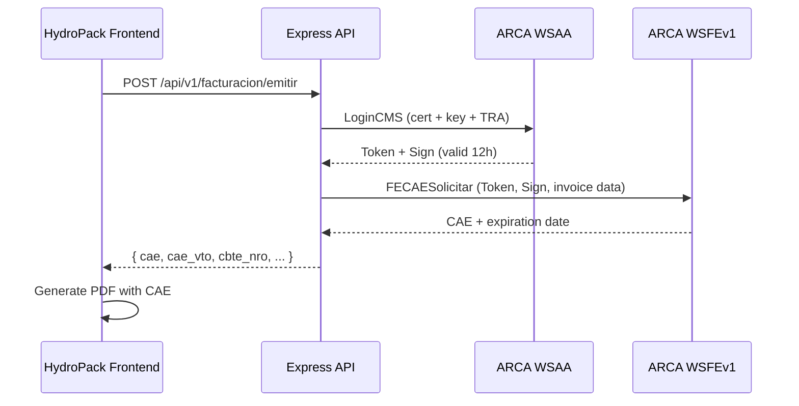

# HydroPack: Rebranding + ARCA Billing Integration

## Overview

Rebrand the existing **Don Nildo** inventory management system (Compras, Ventas, Stock, Pesaje, Proveedores, Reportes) to **HydroPack**, and integrate **ARCA electronic invoicing** (factura electrónica) via their SOAP Web Services.

**Current stack:** React 19 + Vite (frontend) · Express + Supabase + Postgres (API) · Tailwind CSS 4

---

https://www.youtube.com/watch?v=t4aV1jZqLJA

## Part 1: What YOU Need to Do (ARCA Portal — Manual Steps)

> [!IMPORTANT]
> These steps **cannot be automated** — they require your clave fiscal and the ARCA web portal. You should do these first or in parallel while I work on the code.

### 1.1 Get Your Testing Certificate (Homologación)

1. Log into [ARCA with clave fiscal](https://auth.afip.gob.ar/contribuyente_/login.xhtml)
2. Go to **Administrador de Relaciones de Clave Fiscal**
3. Enable the **WSASS** service (Autoservicio de Acceso a APIs de Homologación)
   - Guide: [Cómo adherirse al WSASS](https://www.afip.gob.ar/ws/WSASS/WSASS_como_adherirse.pdf)
4. Generate a CSR (Certificate Signing Request) — I can help you with this command:
   ```bash
   openssl genrsa -out hydropack_homo.key 2048
   openssl req -new -key hydropack_homo.key -subj "/C=AR/O=HydroPack/CN=HydroPack/serialNumber=CUIT XXXXXXX" -out hydropack_homo.csr
   ```
5. Upload the CSR to WSASS and download your signed `.crt` certificate
6. Associate the certificate with **wsfev1** (Factura Electrónica V1) in WSASS

### 1.2 Get Your Production Certificate (later)

1. Use the [Administración de Certificados Digitales](https://auth.afip.gob.ar/contribuyente_/login.xhtml) portal
2. Guide: [Obtener certificado producción](https://www.afip.gob.ar/ws/WSAA/wsaa_obtener_certificado_produccion.pdf)
3. Associate it to wsfev1: [Asociar certificado a WSN](https://www.afip.gob.ar/ws/WSAA/wsaa_asociar_certificado_a_wsn_produccion.pdf)

### 1.3 Information I'll Need From You

| Item | Example | Why |
|------|---------|-----|
| CUIT | `20-XXXXXXXX-X` | Required for all ARCA requests |
| Punto de Venta | `1` to `99998` | Identifies the billing point |
| Condición IVA | Responsable Inscripto, Monotributo, etc. | Determines invoice types (A/B/C) |
| `.key` file | `hydropack_homo.key` | Private key for signing |
| `.crt` file | `hydropack_homo.crt` | Certificate from ARCA |
| Razón Social | `HydroPack S.R.L.` | Company legal name |
| Domicilio Comercial | Address | For invoice header |

---

## Part 2: What I Can Build

### Phase A — Rebranding (Don Nildo → HydroPack)

> [!NOTE]
> This is the simpler phase — systematic string/asset replacement across the codebase.

#### Scope

| Area | Changes |
|------|---------|
| **API `package.json`** | `"name": "dn-api"` → `"hydropack-api"`, description update |
| **API `server.mjs`** | Console logs, healthcheck responses |
| **Frontend** | App title, Header component, login page, favicon, SEO meta tags |
| **UI/UX Overhaul** | Full visual redesign using `frontend-design` skill — new color palette, typography, logo treatment |
| **Database** | No schema changes needed for rebranding |

#### Design Direction (TBD — need your input)

- 💧 **HydroPack** suggests water/hydration — should the aesthetic be clean/aqua/fresh?
- What colors do you like? Current UI is dark theme with teal accents
- Do you have a logo, or should I design concepts?
- Target audience: internal team? External clients?

---

### Phase B — ARCA Billing Integration

This is the big one. Here's the full architecture:

#### B.1 — API Layer: ARCA Service Module

Using **[@afipsdk/afip.js](https://github.com/AfipSDK/afip.js)** (100K+ downloads, MIT, actively maintained, supports TypeScript):

##### New files in `api/src/`:

```
api/
├── src/
│   ├── lib/
│   │   └── arca.mjs              # ARCA client singleton (afip.js wrapper)
│   ├── routes/
│   │   └── facturacion.mjs       # REST endpoints for billing
│   ├── certs/                    # Git-ignored! Your .key and .crt files
│   │   ├── .gitkeep
│   │   └── .gitignore
│   └── ...
```

##### How ARCA Web Services Work (the flow I'll implement):



##### Key endpoints:

| Method | Endpoint | Description |
|--------|----------|-------------|
| `POST` | `/api/v1/facturacion/emitir` | Issue an invoice (Factura A/B/C) |
| `GET` | `/api/v1/facturacion/ultimo-comprobante/:ptoVta/:cbteTipo` | Get last invoice number |
| `GET` | `/api/v1/facturacion/tipos-comprobante` | Valid invoice types |
| `GET` | `/api/v1/facturacion/tipos-iva` | IVA rates |
| `GET` | `/api/v1/facturacion/tipos-documento` | Document types (DNI, CUIT, etc.) |
| `GET` | `/api/v1/facturacion/:id` | Get saved invoice from DB |
| `GET` | `/api/v1/facturacion` | List all invoices (with filters) |
| `GET` | `/api/v1/facturacion/:id/pdf` | Generate/download PDF |

#### B.2 — Database Schema

```sql
-- New tables for billing
CREATE TABLE comprobantes (
    id                 SERIAL PRIMARY KEY,
    tipo_cbte          INT NOT NULL,         -- 1=FA, 6=FB, 11=FC, 3=NCA, 8=NCB, etc.
    punto_vta          INT NOT NULL,
    cbte_nro           BIGINT NOT NULL,
    cbte_desde         BIGINT NOT NULL,
    cbte_hasta         BIGINT NOT NULL,
    fecha_cbte         DATE NOT NULL,
    
    -- Client
    doc_tipo           INT NOT NULL,          -- 80=CUIT, 96=DNI, 99=Consumidor Final
    doc_nro            BIGINT NOT NULL,
    cliente_nombre     TEXT,
    
    -- Amounts
    imp_total          NUMERIC(15,2) NOT NULL,
    imp_neto           NUMERIC(15,2) NOT NULL,
    imp_iva            NUMERIC(15,2) DEFAULT 0,
    imp_trib           NUMERIC(15,2) DEFAULT 0,
    imp_op_ex          NUMERIC(15,2) DEFAULT 0,
    
    -- ARCA response
    cae                VARCHAR(20),
    cae_vto            DATE,
    resultado          VARCHAR(1),            -- A=Aprobado, R=Rechazado
    
    -- Link to sale (optional)
    venta_id           INT REFERENCES ventas(id_venta),
    
    -- Metadata
    concepto           INT DEFAULT 1,         -- 1=Productos, 2=Servicios, 3=Ambos
    moneda_id          VARCHAR(5) DEFAULT 'PES',
    moneda_cotiz       NUMERIC(10,6) DEFAULT 1,
    observaciones      TEXT,
    raw_request        JSONB,
    raw_response       JSONB,
    
    created_by         UUID REFERENCES auth.users(id),
    created_at         TIMESTAMPTZ DEFAULT now(),
    updated_at         TIMESTAMPTZ DEFAULT now()
);

CREATE TABLE comprobante_items (
    id                 SERIAL PRIMARY KEY,
    comprobante_id     INT REFERENCES comprobantes(id),
    descripcion        TEXT NOT NULL,
    cantidad           NUMERIC(15,4) NOT NULL,
    unidad_medida      INT DEFAULT 7,        -- 7 = unidades
    precio_unitario    NUMERIC(15,4) NOT NULL,
    iva_id             INT DEFAULT 5,         -- 5 = 21%
    iva_base_imp       NUMERIC(15,2),
    iva_importe        NUMERIC(15,2),
    subtotal           NUMERIC(15,2) NOT NULL
);

CREATE TABLE comprobante_iva (
    id                 SERIAL PRIMARY KEY,
    comprobante_id     INT REFERENCES comprobantes(id),
    iva_id             INT NOT NULL,           -- 3=0%, 4=10.5%, 5=21%, 6=27%
    base_imp           NUMERIC(15,2) NOT NULL,
    importe            NUMERIC(15,2) NOT NULL
);

-- Configuration table for ARCA settings
CREATE TABLE arca_config (
    id                 SERIAL PRIMARY KEY,
    cuit               BIGINT NOT NULL,
    razon_social       TEXT NOT NULL,
    punto_vta          INT NOT NULL,
    condicion_iva      INT NOT NULL,
    domicilio          TEXT,
    iibb               TEXT,
    inicio_actividades DATE,
    is_production      BOOLEAN DEFAULT false,
    created_at         TIMESTAMPTZ DEFAULT now(),
    updated_at         TIMESTAMPTZ DEFAULT now()
);

-- Indexes
CREATE UNIQUE INDEX idx_cbte_unique ON comprobantes(tipo_cbte, punto_vta, cbte_nro);
CREATE INDEX idx_cbte_venta ON comprobantes(venta_id);
CREATE INDEX idx_cbte_fecha ON comprobantes(fecha_cbte DESC);
```

#### B.3 — Frontend: Billing Module

New pages/components:

| Component | Route | Description |
|-----------|-------|-------------|
| `Facturacion.jsx` | `/facturacion` | Invoice list with filters, status |
| `EmitirFactura.jsx` | `/facturacion/nueva` | Form to create & emit invoice |
| `FacturaDetalle.jsx` | `/facturacion/:id` | View invoice + download PDF |
| `ArcaConfig.jsx` | `/configuracion/arca` | Admin settings for CUIT, punto de venta |

The **EmitirFactura** form would optionally link to an existing sale (`ventas`) so you can auto-populate items.

#### B.4 — PDF Generation

Enhanced PDF with CAE barcode/QR:
- Legal invoice format per ARCA requirements
- QR code with invoice URL (as required by RG 4291)
- Downloadable / printable

---

## Open Questions

> [!IMPORTANT]
> I need your input on these before starting:

1. **Invoice types needed?** 
   - Factura A (B2B, Responsable Inscripto)
   - Factura B (B2C, Consumidor Final)
   - Factura C (Monotributo)
   - Nota de Crédito A/B/C
   
2. **Should invoicing be tied to Ventas?** i.e., when you register a sale, optionally generate an invoice — or keep them independent?

3. **Design direction for HydroPack** — colors, tone, do you have a logo?

4. **Punto de Venta** — do you already have one assigned in ARCA, or do you need to create one?

5. **Supabase project** — I see the current Supabase project is "Aplicacion Nutricion Ini". Will HydroPack use a **new** Supabase project, or the same one? (You mentioned you'd give me the token later)

6. **Should I start with homologación (testing) first?** This uses the testing WSAA (`wsaahomo.afip.gov.ar`) so we can develop and test without real fiscal impact.

---

## Verification Plan

### Automated Tests
- Test ARCA authentication flow against homologación endpoint
- Test invoice creation with sample data
- Verify CAE is returned and stored correctly
- Test PDF generation output

### Manual Verification
- Full end-to-end: create a sale → emit invoice → verify CAE in ARCA
- Cross-check invoice number sequence via `FECompUltimoAutorizado`
- Verify PDF matches legal requirements

---

## Suggested Execution Order

1. **Phase A** — Rebranding (can start immediately)
2. **Phase B.1** — ARCA service module (once you have the testing cert)
3. **Phase B.2** — Database schema (once you confirm Supabase project)
4. **Phase B.3** — Frontend billing module
5. **Phase B.4** — PDF generation with QR/CAE
